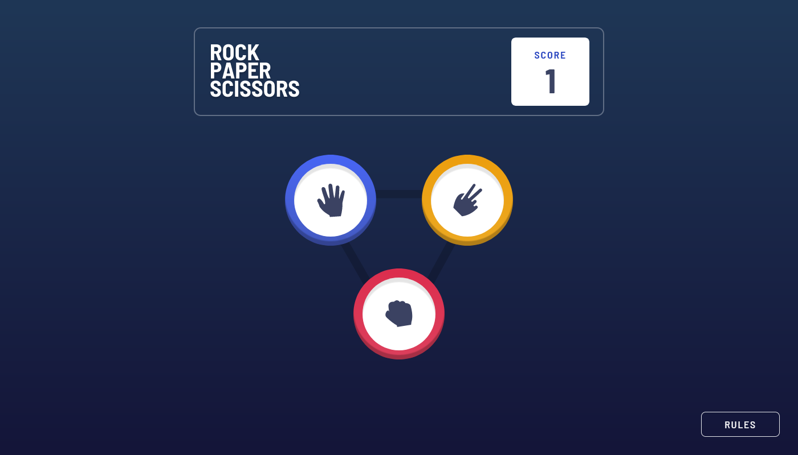

# Frontend Mentor - Rock, Paper, Scissors solution

This is a solution to the [Rock, Paper, Scissors challenge on Frontend Mentor](https://www.frontendmentor.io/challenges/rock-paper-scissors-game-pTgwgvgH). Frontend Mentor challenges help you improve your coding skills by building realistic projects.

## Table of contents

- [Overview](#overview)
  - [The challenge](#the-challenge)
  - [Screenshot](#screenshot)
  - [Links](#links)
- [My process](#my-process)
  - [Built with](#built-with)
  - [What I learned](#what-i-learned)
- [Author](#author)

## Overview

### The challenge

Users should be able to:

- View the optimal layout for the game depending on their device's screen size
- Play Rock, Paper, Scissors against the computer
- Maintain the state of the score after refreshing the browser

### Screenshot



### Links

- Solution URL: [GitHub Repo](https://github.com/agusthas/rock-paper-scissors-main)
- Live Site URL: [Vercel](https://rock-paper-scissors-main.vercel.app/)

## My process

### Built with

- Flexbox
- CSS Grid
- [React](https://reactjs.org/) - JS library
- [Vite](https://vitejs.dev/) - Bundler
- [TailwindCSS](https://tailwindcss.com/) - For styles

### What I learned

That i'm lazy to find a way to change the `Hand` styles for different breakpoints, so i just _hacked_ by show and hide those elements.

```js
<div className='flex flex-col-reverse gap-6 sm:flex-col sm:gap-16'>
  <p className='relative z-10 font-semibold tracking-widest text-white sm:text-3xl'>
    YOU PICKED
  </p>
  {/* For Desktop */}
  <div className='hidden sm:block'>
    <Hand type={playerHand} size='lg' ripple={playerHand === winnerHand} />
  </div>
  {/* For Mobile */}
  <div className='sm:hidden'>
    <Hand type={playerHand} size='sm' ripple={playerHand === winnerHand} />
  </div>
</div>
```

## Author

- Frontend Mentor - [@agusthas](https://www.frontendmentor.io/profile/agusthas)
- Twitter - [@agusthas](https://www.twitter.com/agusthas)
